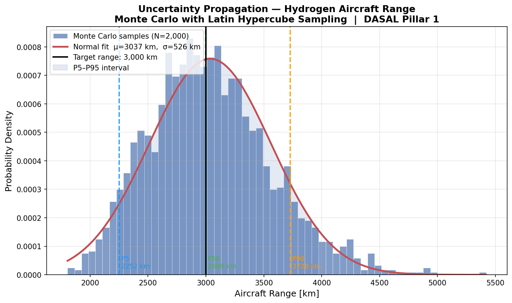
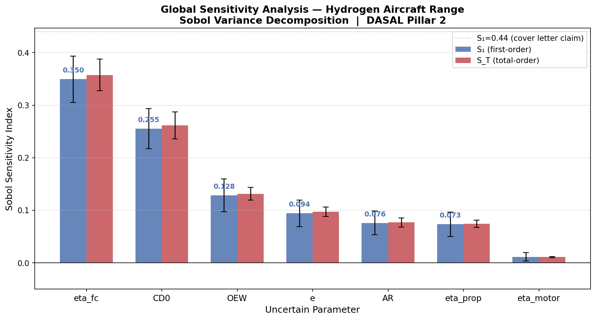
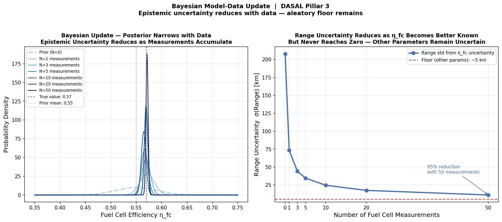

# h2aircraft-uq

**Uncertainty-Aware Conceptual Design of a Medium-Haul Hydrogen Fuel Cell Aircraft**

*DASAL PhD Application Preparation — Gamar Ismayilova, June 2026*

---

## Research Question

Which design parameter uncertainty most constrains the achievable range of a medium-haul hydrogen fuel cell aircraft — and how does the answer change as measurement data accumulates?

---

## Motivation

When designing a novel hydrogen aircraft at conceptual stage, every input parameter carries uncertainty. A deterministic model gives a single range prediction and false confidence. This project builds a physics-based uncertainty quantification framework that honestly propagates parameter uncertainty through a modified Breguet range equation and identifies where to invest measurement effort to most efficiently reduce range uncertainty.

This work directly addresses the three research pillars of the DASAL PhD position at TU Delft (Dr. R.P. Dwight, in collaboration with NLR):

| DASAL Pillar | This Project |
|---|---|
| **Pillar 1** — Uncertainty propagation | Monte Carlo with Latin Hypercube Sampling |
| **Pillar 2** — Global sensitivity analysis | Sobol variance decomposition (SALib) |
| **Pillar 3** — Model-data comparison | Bayesian posterior update |

---

## Physical Model

Modified Breguet range equation for hydrogen fuel cell propulsion:

```
R = (L/D) × η_total × (E_H2 / g) × ln(MTOW / OEW)
```

Where:
- `L/D` — lift-to-drag ratio, derived from drag polar: `L/D_max = 0.5 × sqrt(π × AR × e / CD0)`
- `η_total = η_fc × η_motor × η_prop` — total propulsive efficiency
- `E_H2 = 120 MJ/kg` — specific energy of hydrogen (3× kerosene)
- `MTOW / OEW` — weight ratio resolved by iterative convergence

**Deterministic design point** (Hoelzen 2022 parameters):
- L/D = 16.81 | η_total = 0.444 | MTOW = 46,502 kg | Fuel fraction = 3.2% | Range = 3,000 km

The low fuel fraction (3.2% vs ~40% for kerosene aircraft) means iterative sizing converges in 2 iterations — hydrogen's high specific energy nearly eliminates the circular dependency between fuel mass and total weight.

---

## Uncertain Parameters

All uncertainty at conceptual design stage is **epistemic** — reducible with better data or higher-fidelity models. No aleatory uncertainty is modelled at mission-average level.

| Parameter | Mean | Std | CV | Physical justification |
|---|---|---|---|---|
| `eta_fc` | 0.55 | 0.04 | 7.3% | Limited aviation-grade stack data |
| `CD0` | 0.020 | 0.003 | 15.0% | Surface finish, interference drag |
| `e` | 0.80 | 0.06 | 7.5% | Empirical correlation, wide scatter across types |
| `OEW` | 45,000 kg | 2,000 kg | 4.4% | Tank mass, system integration uncertainty |
| `AR` | 9.0 | 0.5 | 5.6% | Structural/aerodynamic trade-off unresolved |
| `eta_prop` | 0.85 | 0.03 | 3.5% | Novel propeller design not flight-tested |
| `eta_motor` | 0.95 | 0.01 | 1.1% | Mature technology, narrow uncertainty |

---

## Results

### Pillar 1 — Uncertainty Propagation

Monte Carlo with N=2,000 Latin Hypercube samples:

| Statistic | Value |
|---|---|
| Mean range | 3,037 km |
| Std deviation | 526 km |
| CV | 17.3% |
| P5 (worst 5%) | 2,252 km |
| P50 (median) | 2,999 km |
| P90 | 3,728 km |

**Key insight:** The deterministic model gives exactly 3,000 km. The UQ model reveals a 17.3% coefficient of variation — the aircraft could realistically achieve anywhere from 2,252 to 3,728 km depending on actual parameter values. This changes the design conversation from "does the design meet the target?" to "what confidence level does the design guarantee?"



---

### Pillar 2 — Global Sensitivity Analysis

Sobol first-order (S₁) and total-order (S_T) indices (N=1,024 base samples → 16,384 model evaluations):

| Parameter | S₁ | S_T | Interaction |
|---|---|---|---|
| `eta_fc` | **0.350** | 0.357 | 0.008 |
| `CD0` | 0.255 | 0.262 | 0.006 |
| `OEW` | 0.128 | 0.131 | 0.003 |
| `e` | 0.094 | 0.097 | 0.003 |
| `AR` | 0.076 | 0.077 | 0.001 |
| `eta_prop` | 0.073 | 0.074 | 0.001 |
| `eta_motor` | 0.011 | 0.011 | 0.000 |

**Key insight:** Fuel cell efficiency (`eta_fc`) dominates with S₁=0.35, explaining 35% of range variance alone. This contradicts the initial hypothesis that aerodynamic uncertainty (Oswald factor `e`) would dominate — a hypothesis based on reasoning from conventional aircraft. The actual UQ analysis revealed that `eta_fc` uncertainty is both wider in absolute terms and enters the Breguet equation more directly than `e`, which is dampened by the square root in the L/D expression. **This is why we run the analysis rather than relying on intuition.**

Interaction effects (S_T − S₁) are negligible for all parameters, indicating the range equation is nearly additive in its parameter sensitivities at this operating point.



---

### Pillar 3 — Bayesian Model-Data Update

Conjugate Gaussian update applied to `eta_fc` (dominant parameter) as fuel cell bench test measurements accumulate:

| Measurements | η_fc posterior mean | η_fc posterior std | Range uncertainty |
|---|---|---|---|
| 0 (prior) | 0.550 | 0.0400 | 208 km |
| 1 | 0.572 | 0.0140 | 73 km |
| 5 | 0.567 | 0.0066 | 35 km |
| 10 | 0.565 | 0.0047 | 25 km |
| 50 | 0.571 | 0.0021 | 11 km |

**Key insight:** 50 fuel cell measurements reduce `eta_fc` uncertainty by 94.7% and range uncertainty from 208 km to 11 km. However, range uncertainty never reaches zero — a residual floor (~5 km) remains from other uncertain parameters. **Reducing one parameter's epistemic uncertainty does not eliminate total range uncertainty; all dominant sources must be addressed simultaneously.** This is the core DASAL message: a coupled digital thread requires a systematic framework, not parameter-by-parameter refinement.



---

## Project Structure

```
h2aircraft-uq/
├── main.py                      ← run all three pillars
├── requirements.txt
├── README.md
├── src/
│   ├── aircraft_model.py        ← Breguet range equation + iterative sizing
│   ├── uncertainty_model.py     ← parameter distributions + aleatory/epistemic taxonomy
│   ├── propagation.py           ← Monte Carlo + LHS (DASAL Pillar 1)
│   ├── sensitivity.py           ← Sobol S1 + ST via SALib (DASAL Pillar 2)
│   └── bayesian_update.py       ← Bayesian posterior update (DASAL Pillar 3)
└── results/
    ├── 01_range_distribution.png
    ├── 02_sobol_indices.png
    └── 03_bayesian_update.png
```

---

## How to Run

```bash
git clone https://github.com/qama94/h2aircraft-uq
cd h2aircraft-uq
pip install -r requirements.txt
python main.py
```

Or run individual modules:

```bash
python src/aircraft_model.py    # deterministic design point
python src/propagation.py       # Monte Carlo propagation
python src/sensitivity.py       # Sobol sensitivity analysis
python src/bayesian_update.py   # Bayesian update
```

---

## Key References

- Hoelzen et al. (2022) — hydrogen aviation system parameters
- Saltelli et al. — *Sensitivity Analysis in Practice*, Chapter 1
- Dwight R.P. — Bayesian calibration and UQ in computational models
- SALib documentation — `salib.readthedocs.io`

---

## Connection to DASAL

This project is a small-scale demonstration of the methodology DASAL applies at aircraft system level. The Breguet range equation is a single-component model with seven uncertain inputs. A full DASAL digital thread connects aerodynamic, propulsion, structural, thermal, and mission models — each with their own uncertain parameters, and with structural modelling assumptions that propagate across component boundaries. The framework built here — uncertainty characterisation, Monte Carlo propagation, Sobol decomposition, Bayesian updating — is the same framework DASAL extends to that coupled multi-component context.
