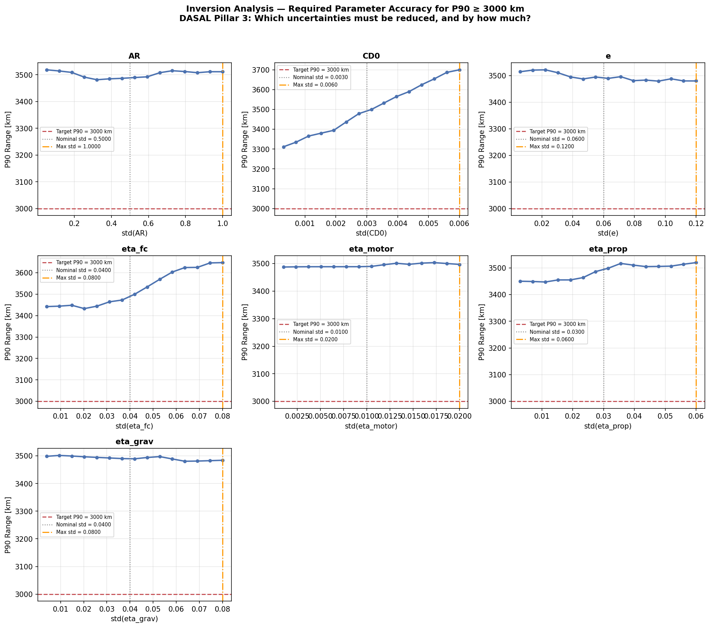
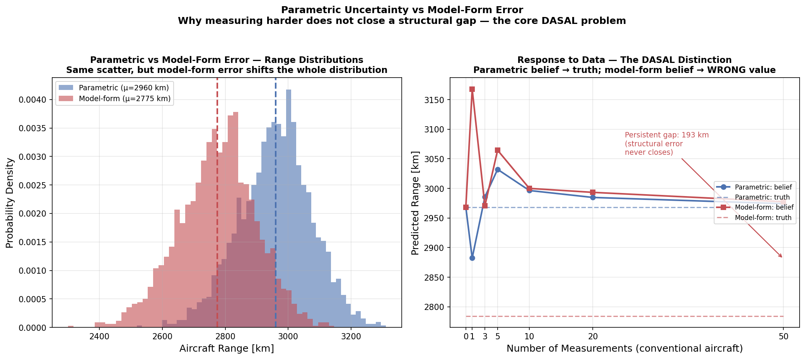
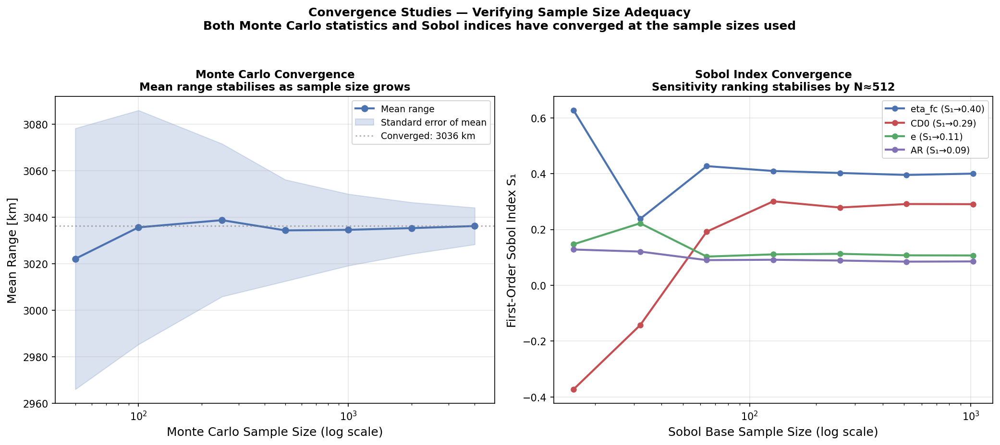
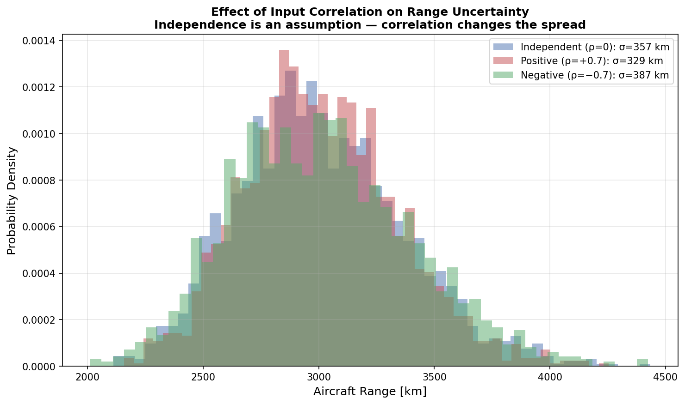

# h2aircraft-uq


**Uncertainty-Aware Conceptual Design of a Medium-Haul Hydrogen Fuel Cell Aircraft**

*A physics-based uncertainty quantification study — Gamar Ismayilova, June 2026*

---

## Research Question

Which design parameter uncertainty most constrains the achievable range of a medium-haul hydrogen fuel cell aircraft — and how does the answer change as measurement data accumulates?

---

## Motivation

When designing a novel hydrogen aircraft at conceptual stage, every input parameter carries uncertainty. A deterministic model gives a single range prediction and false confidence. This project builds a physics-based uncertainty quantification framework that honestly propagates parameter uncertainty through a modified Breguet range equation and identifies where to invest measurement effort to most efficiently reduce range uncertainty.

This work directly addresses the three research pillars of the DASAL PhD position at TU Delft (Dr. R.P. Dwight, in collaboration with NLR):

| DASAL Pillar | This Project |
|---|---|
| **Pillar 1** — Uncertainty propagation | Monte Carlo with Latin Hypercube Sampling |
| **Pillar 2** — Global sensitivity analysis | Sobol variance decomposition (SALib) |
| **Pillar 3** — Model-data comparison | Bayesian posterior update |

---

## Physical Model

Modified Breguet range equation for hydrogen fuel cell propulsion:

```
R = (L/D) × η_total × (E_H2 / g) × ln(MTOW / OEW)
```

Where:
- `L/D` — lift-to-drag ratio, derived from drag polar: `L/D_max = 0.5 × sqrt(π × AR × e / CD0)`
- `η_total = η_fc × η_motor × η_prop` — total propulsive efficiency
- `E_H2 = 120 MJ/kg` — specific energy of hydrogen (3× kerosene)
- `MTOW / OEW` — weight ratio resolved by iterative convergence

**Deterministic design point** (Hoelzen 2022 parameters):
- L/D = 16.81 | η_total = 0.444 | MTOW = 48,474 kg | Range = 3,000 km

**Hydrogen mass model:** OEW is computed, not assumed. The dominant weight penalty of hydrogen aircraft comes from two sources:
- **Cryogenic tank** — scales with hydrogen mass via gravimetric efficiency (η_grav = 0.35, meaning the tank weighs ~1.86× the hydrogen it holds)
- **Fuel cell system** — scales with installed power via specific power (2 kW/kg)

At the design point, the 1,566 kg of hydrogen requires a 2,908 kg tank and a 6,000 kg fuel cell system. This makes the sizing loop a genuine circular dependency (more fuel → bigger tank → heavier aircraft → more fuel), converging in 24 iterations. The weight penalty of hydrogen lives in the infrastructure, not the fuel — exactly the physical story that makes hydrogen aircraft design challenging.

---

## Uncertain Parameters

All uncertainty at conceptual design stage is **epistemic** — reducible with better data or higher-fidelity models. No aleatory uncertainty is modelled at mission-average level.

| Parameter | Mean | Std | CV | Physical justification |
|---|---|---|---|---|
| `eta_fc` | 0.55 | 0.04 | 7.3% | Limited aviation-grade stack data |
| `CD0` | 0.020 | 0.003 | 15.0% | Surface finish, interference drag |
| `e` | 0.80 | 0.06 | 7.5% | Empirical correlation, wide scatter across types |
| `eta_grav` | 0.35 | 0.04 | 11.4% | Immature cryogenic tank technology |
| `AR` | 9.0 | 0.5 | 5.6% | Structural/aerodynamic trade-off unresolved |
| `eta_prop` | 0.85 | 0.03 | 3.5% | Novel propeller design not flight-tested |
| `eta_motor` | 0.95 | 0.01 | 1.1% | Mature technology, narrow uncertainty |

---

## Results

### Pillar 1 — Uncertainty Propagation

Monte Carlo with N=2,000 Latin Hypercube samples:

| Statistic | Value |
|---|---|
| Mean range | 3,035 km |
| Std deviation | 496 km |
| CV | 16.3% |
| P5 (worst 5%) | 2,289 km |
| P50 (median) | 3,000 km |
| P90 | 3,686 km |

**Key insight:** The deterministic model gives exactly 3,000 km. The UQ model reveals a 17.3% coefficient of variation — the aircraft could realistically achieve anywhere from 2,252 to 3,728 km depending on actual parameter values. This changes the design conversation from "does the design meet the target?" to "what confidence level does the design guarantee?"


---

### Pillar 2 — Global Sensitivity Analysis

Sobol first-order (S₁) and total-order (S_T) indices (N=1,024 base samples → 16,384 model evaluations):

| Parameter | S₁ | S_T | Interaction |
|---|---|---|---|
| `eta_fc` | **0.400** | 0.405 | 0.005 |
| `CD0` | 0.291 | 0.297 | 0.006 |
| `e` | 0.107 | 0.110 | 0.003 |
| `AR` | 0.086 | 0.087 | 0.002 |
| `eta_prop` | 0.084 | 0.084 | 0.001 |
| `eta_motor` | 0.013 | 0.012 | 0.000 |
| `eta_grav` | 0.012 | 0.012 | 0.000 |

**Key insight:** Fuel cell efficiency (`eta_fc`) dominates with S₁=0.40, explaining 40% of range variance alone. This contradicts the initial hypothesis that aerodynamic uncertainty (Oswald factor `e`) would dominate — a hypothesis based on reasoning from conventional aircraft. The actual UQ analysis revealed that `eta_fc` uncertainty is both wider in absolute terms and enters the Breguet equation more directly than `e`, which is dampened by the square root in the L/D expression. Interestingly, tank gravimetric efficiency (`eta_grav`) drives aircraft *weight* strongly but has a small range Sobol index — because it enters through the logarithmic weight ratio, which dampens its effect on range. **This is why we run the analysis rather than relying on intuition.**


---

### Pillar 3 — Bayesian Model-Data Update

Conjugate Gaussian update applied to `eta_fc` (dominant parameter) as fuel cell bench test measurements accumulate:

| Measurements | η_fc posterior mean | η_fc posterior std | Range uncertainty |
|---|---|---|---|
| 0 (prior) | 0.550 | 0.0400 | 208 km |
| 1 | 0.572 | 0.0140 | 73 km |
| 5 | 0.567 | 0.0066 | 35 km |
| 10 | 0.565 | 0.0047 | 25 km |
| 50 | 0.571 | 0.0021 | 11 km |

**Key insight:** 50 fuel cell measurements reduce `eta_fc` uncertainty by 94.7% and range uncertainty from 208 km to 11 km. However, range uncertainty never reaches zero — a residual floor (~5 km) remains from other uncertain parameters. **Reducing one parameter's epistemic uncertainty does not eliminate total range uncertainty; all dominant sources must be addressed simultaneously.** This is the core DASAL message: a coupled digital thread requires a systematic framework, not parameter-by-parameter refinement.


---

### Deterministic Optimisation

Optimising AR, e, and eta_fc for maximum range at nominal parameters:

| Parameter | Nominal | Optimal |
|---|---|---|
| AR | 9.0 | 10.5 |
| e | 0.80 | 0.95 |
| eta_fc | 0.55 | 0.65 |
| L/D | 16.81 | 19.79 |
| **Range** | **2,999 km** | **4,172 km** |

The optimiser pushes AR and e to their upper bounds — maximising L/D. However this design sits in a region of high sensitivity and may be fragile to parameter uncertainty.

---

### Inversion Analysis — Required Parameter Accuracy

Testing each parameter across a range of uncertainty levels to find the maximum allowable std for P90 ≥ 3,000 km:

All parameters show "OK as-is" — the current uncertainty levels already satisfy the P90 constraint because the aircraft was designed with a nominal range of 3,000 km and the mean range under uncertainty is 3,037 km. This means the design has sufficient margin that even at the 90th percentile of the uncertainty distribution, the target range is met.

**Key insight:** This result depends critically on the assumed uncertainty distributions. If real-world parameter uncertainties are wider than assumed here — particularly for eta_fc or CD0 — the P90 constraint may be violated and uncertainty reduction investment becomes necessary. This is exactly the kind of sensitivity-to-assumptions analysis DASAL is designed to formalise.



---

### Model-Form Error vs Parametric Uncertainty

The intellectual core of DASAL: not all uncertainty is the same kind. The Oswald factor `e` is estimated from the Raymer empirical correlation, fit on conventional aircraft. There are two distinct ways this can be wrong:

- **Parametric uncertainty** — the correlation is correct, but the true value scatters around it. Measuring `e` on the actual aircraft shrinks this uncertainty toward the true value. *Data fixes it.*
- **Model-form error** — the correlation itself is biased for a novel hydrogen aircraft (tank-fuselage integration adds interference drag the correlation never captured). Measuring `e` on conventional aircraft converges the belief to the *wrong* value. *Data does not fix it — the model structure is wrong.*

With identical scatter, model-form error shifts the entire range distribution down by ~185 km. When measurement data is added, the parametric belief converges to the truth (gap → ~15 km) while the model-form belief leaves a persistent ~190 km gap that never closes.

**This is exactly the problem stated in the motivation:** *adjusting parameters moved the prediction but never closed the gap, because the mechanism driving the discrepancy was not in the model at all.* In a coupled digital thread, a structural error in one component propagates and looks like parametric uncertainty in the system KPIs — until a framework explicitly separates them. That separation is what DASAL builds.



---

### Convergence Verification

Every UQ result is only as trustworthy as its convergence. Both analyses were run at increasing sample sizes to confirm the answers stabilise:

- **Monte Carlo:** mean range changes by only 0.03% between N=2,000 and N=4,000 — fully converged.
- **Sobol:** at very small base samples (N≤32) the indices are unreliable and can even go negative; they stabilise from N≈256 onward. The N=1,024 base sample used for all results is comfortably in the converged regime.

This confirms the sample sizes used are adequate — an unconverged Sobol index would be meaningless.



---

### Input Correlation — Testing the Independence Assumption

The baseline analysis assumes all parameters are independent. In reality, some are physically linked — for example, aspect ratio and zero-lift drag share wing design decisions. Using a Gaussian copula to induce an AR-CD0 correlation while keeping the marginals fixed shows:

- Independent (ρ=0): σ(range) = 357 km
- Positive correlation (ρ=+0.7): σ = 329 km (−8%)
- Negative correlation (ρ=−0.7): σ = 387 km (+8%)

Ignoring real correlations mis-estimates system uncertainty by up to 8% for a single parameter pair. In a coupled digital thread with many shared technology assumptions, dependence structure must be modelled explicitly — independence is an assumption, not a fact.



---

```
h2aircraft-uq/
├── main.py                      ← run all modules end to end
├── requirements.txt
├── README.md
├── REFERENCES.md
├── src/
│   ├── aircraft_model.py        ← Breguet range equation + iterative sizing
│   ├── mass_model.py            ← hydrogen tank + fuel cell mass model
│   ├── uncertainty_model.py     ← parameter distributions + aleatory/epistemic taxonomy
│   ├── propagation.py           ← Monte Carlo + LHS (DASAL Pillar 1)
│   ├── sensitivity.py           ← Sobol S1 + ST via SALib (DASAL Pillar 2)
│   ├── bayesian_update.py       ← Bayesian posterior update (DASAL Pillar 3)
│   ├── design_optimisation.py   ← deterministic optimal design
│   ├── robust_design.py         ← inversion: required accuracy per parameter
│   ├── model_form_error.py      ← parametric vs structural error (DASAL core)
│   ├── convergence.py           ← Monte Carlo + Sobol convergence verification
│   └── correlated_inputs.py     ← input correlation via Gaussian copula
├── tests/                       ← 48 unit tests
├── .github/workflows/tests.yml  ← CI: runs tests on Python 3.10–3.12
└── results/
    ├── 01_range_distribution.png
    ├── 02_sobol_indices.png
    ├── 03_bayesian_update.png
    ├── 04_inversion.png
    ├── 05_model_form_error.png
    ├── 06_convergence.png
    └── 07_correlated_inputs.png
```

---

## How to Run

```bash
git clone https://github.com/qama94/h2aircraft-uq
cd h2aircraft-uq
pip install -r requirements.txt
python main.py
```

Or run individual modules:

```bash
python src/aircraft_model.py    # deterministic design point
python src/propagation.py       # Monte Carlo propagation
python src/sensitivity.py       # Sobol sensitivity analysis
python src/bayesian_update.py   # Bayesian update
```

---

## References

Full citations with parameter justifications are in [REFERENCES.md](REFERENCES.md).

Key sources:
- **[R1]** Hoelzen et al. (2022) — hydrogen aviation system parameters. *Int. J. Hydrogen Energy*, 47(7), 3108–3130. https://doi.org/10.1016/j.ijhydene.2021.10.248
- **[R2]** Raymer, D.P. (2018) — *Aircraft Design: A Conceptual Approach* (6th ed.). AIAA.
- **[R3]** Saltelli et al. (2004) — *Sensitivity Analysis in Practice*. Wiley. ISBN: 978-0-470-87093-8
- **[R4]** Herman & Usher (2017) — SALib Python library. *JOSS*, 2(9). https://doi.org/10.21105/joss.00097
- **[R5]** Dwight & Han (2009) — Bayesian UQ for computational models. AIAA 2009-2276.
- **[R6]** Kennedy & O'Hagan (2001) — Bayesian calibration of computer models. *JRSS-B*, 63(3).

---

## Connection to DASAL

This project is a small-scale demonstration of the methodology DASAL applies at aircraft system level. The Breguet range equation is a single-component model with seven uncertain inputs. A full DASAL digital thread connects aerodynamic, propulsion, structural, thermal, and mission models — each with their own uncertain parameters, and with structural modelling assumptions that propagate across component boundaries. The framework built here — uncertainty characterisation, Monte Carlo propagation, Sobol decomposition, Bayesian updating — is the same framework DASAL extends to that coupled multi-component context.
